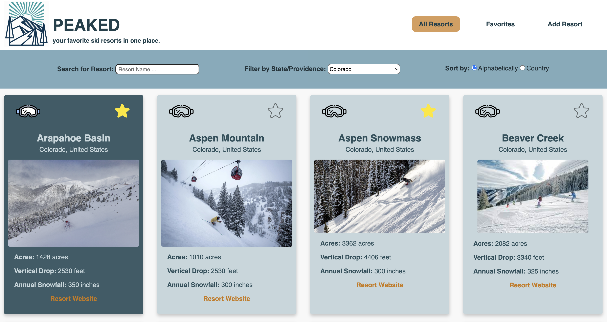

# PEAKED | your favorite ski resorts in one place.

Summary: As an avid skier, I decided to build a web application where I could track the ski resorts I have skied. My website, Peaked, allows users to browse (filter and search), favorite, and track ski resorts within North America. Peaked is designed to help users track ski resorts they have visited, add a ski resort not found within the database, as well as organize ski resorts they love and/or want to visit in the future.

As a user:
 - I can search ski resorts in North America using a Search bar and a filterable list.
 - I can view descriptions, details, and images by interacting with cards for up to 130 ski resorts.
 - I can fill out a form to add ski resorts not currently found in the database, such as smaller, lesser-know ski resorts.
 - I can click on an embedded link on each ski resort card that will direct me to the specific ski resort's website.
 - I can click on the star icon to indicate a "favorite" resort and that ski resort will now appear in the "Favorites" tab.
 - I can also click on the google icon to indicate I have visited that resort, and the colorway of the card will change to dark theme so it is easy to visualize which ski resorts I have visited.


To start server side:
```
$ npm run server
```

To start client side:
```
$ npm run dev
```


